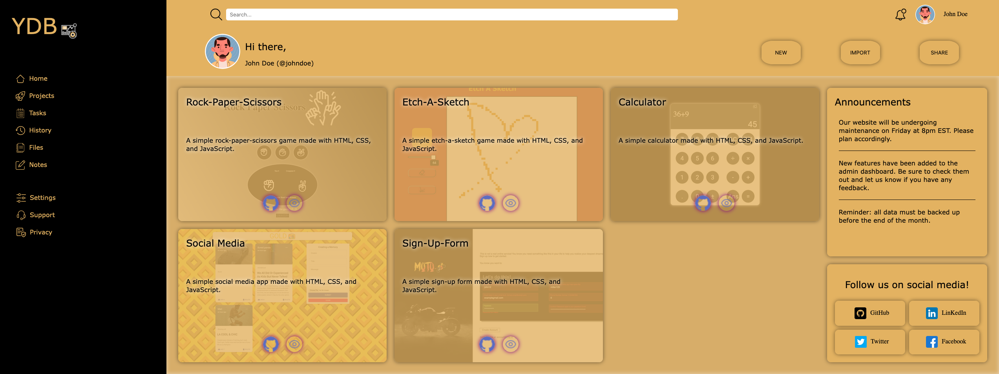
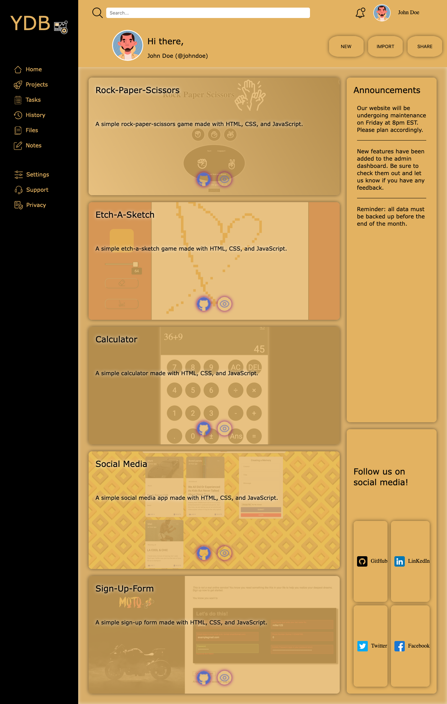

# Admin-Dashboard

This is a simple admin dashboard built with HTML and CSS. just to learn more about CSS(Grid).

## Live Demo

Take a look at the live demo [here](https://mosmn.github.io/Admin-Dashboard/).

## Screenshot

## Technologies Used

- HTML
- CSS(Grid and Flexbox)

## Approach

First, I started by creating the HTML structure and the basic CSS grid layout. Then I started adding the content and styling it. Nested the grid inside the grid to create the sidebar and the main content. I used flexbox to align the content inside the grid cells. I used auto-fit and auto-fill and dynamic unit `fr` to make the grid responsive. and for the projects background image section, I used `::before` pseudo-element to add the background image and then used z-index to make the text and links appear on top of the image. I used `:hover` pseudo-class to add some effects to the links and buttons.

## Challenges

The biggest challenge was to make the grid responsive. I had to use `auto-fit` and `auto-fill` and `fr` unit to make the grid responsive. I also stuggled a little with the background image section. I had to use `::before` pseudo-element to add the background image and then used z-index to make the text and links appear on top of the image, which was kinda completely new to me but I learned a lot from it.

## Future Features

- Add more pages.
- Add more content.
- Add more effects.
- Add more responsiveness.